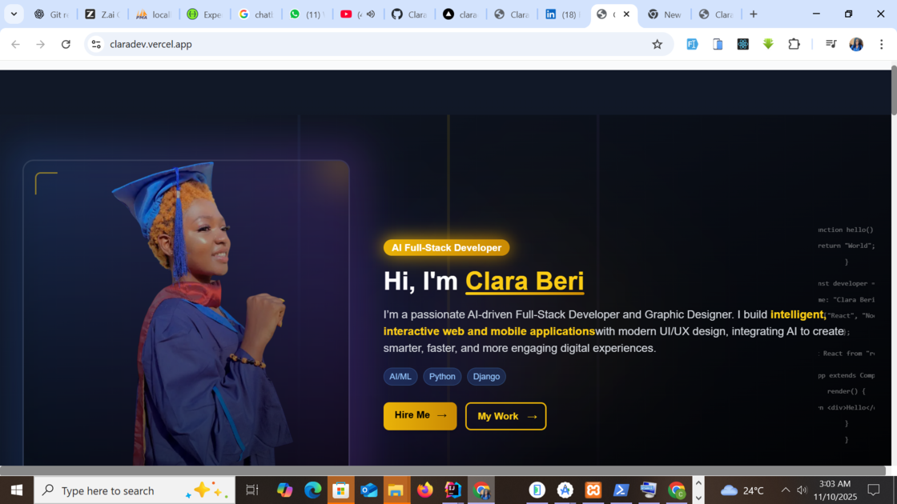

# 🌟 Clara Beri — Portfolio Website



A modern, responsive portfolio website built with **Next.js**, showcasing my work as a **Full-Stack Web & Mobile Developer** and **Graphic Designer**.

---

## 🧭 About

This portfolio represents my professional journey, skills, and creative experience. It features:

- Responsive design across all devices
- Clean, modern UI/UX
- Interactive elements and smooth animations
- Showcase of skills, services, and career highlights

This website highlights my ability to merge **creativity with technology** to build impactful digital experiences.

---

## 🚀 Features

- **Responsive Design** – Seamlessly adapts to all devices
- **Interactive Hero Section** – Split-screen layout with hover effects
- **Skills Display** – Categorized skill sets with icons
- **Testimonials Carousel** – Animated client testimonials
- **Service Overview** – Professional services and expertise
- **Contact Form** – Validated form for direct connection
- **Smooth Animations** – Powered by Framer Motion
- **Dark/Light Theme** – Customizable theme options

---

## 🛠️ Built With

- **Framework:** Next.js 13+ (App Router)
- **Styling:** Tailwind CSS
- **Animations:** Framer Motion
- **Icons:** React Icons
- **Fonts:** Poppins & Montserrat
- **Storage:** LocalStorage (for testimonials)
- **Deployment:** Vercel

---

## 📁 Project Structure

Clara-Portfolio/
├── app/ # Next.js App Router
│ ├── about/ # About Page
│ ├── career/ # Career Page
│ ├── contact/ # Contact Page
│ ├── projects/ # Projects Page
│ ├── services/ # Services Page
│ ├── skills/ # Skills Page
│ ├── testimonials/ # Testimonials Page
│ ├── globals.css # Global Styles
│ └── layout.jsx # Root Layout
├── components/ # Reusable Components
│ ├── ui/ # UI Components
│ └── SectionTitle.jsx # Section Header
├── public/ # Static Assets
│ ├── images/ # Images & Icons
│ └── favicon.ico # Favicon
├── styles/ # Global Custom Styles
├── package.json # Dependencies
└── README.md # Documentation


---

## 📱 Pages Overview

- **Home:** Hero intro, featured projects, services & skills, testimonials
- **About:** Personal journey, timeline, interests
- **Career:** Academic background, experience, certifications
- **Projects:** Filterable gallery with tech stacks & links
- **Services:** Service categories and expertise highlights
- **Skills:** Technical skills and tools breakdown
- **Testimonials:** Animated carousel, add testimonials
- **Contact:** Form, social icons, location map

---

## ⚙️ Getting Started

### Prerequisites
- Node.js 18+
- npm or yarn

### Installation
```bash
# Clone repository
git clone https://github.com/ClaraDEV-Fullstack/Clara-Portfolio.git
cd Clara-Portfolio

# Install dependencies
npm install

# Run development server
npm run dev


Open http://localhost:3000
 in your browser.

Build for Production
npm run build
npm start

🌐 Deployment

This portfolio is deployed on Vercel.
Live Demo: https://claradev.vercel.app

Push changes to GitHub, and Vercel automatically redeploys the site.

🤝 Contributing

Contributions are welcome!

Open an issue for suggestions or bugs

Submit a pull request for improvements

📧 Contact

Clara Beri

Email: claraberi63@gmail.com

LinkedIn: linkedin.com/in/clara-beri

GitHub: github.com/ClaraDEV-Fullstack

Portfolio: https://claradev.vercel.app

📄 License

This project is licensed under the MIT License. See LICENSE
 for details.

Built with ❤️ using Next.js, Tailwind CSS, and Framer Motion.